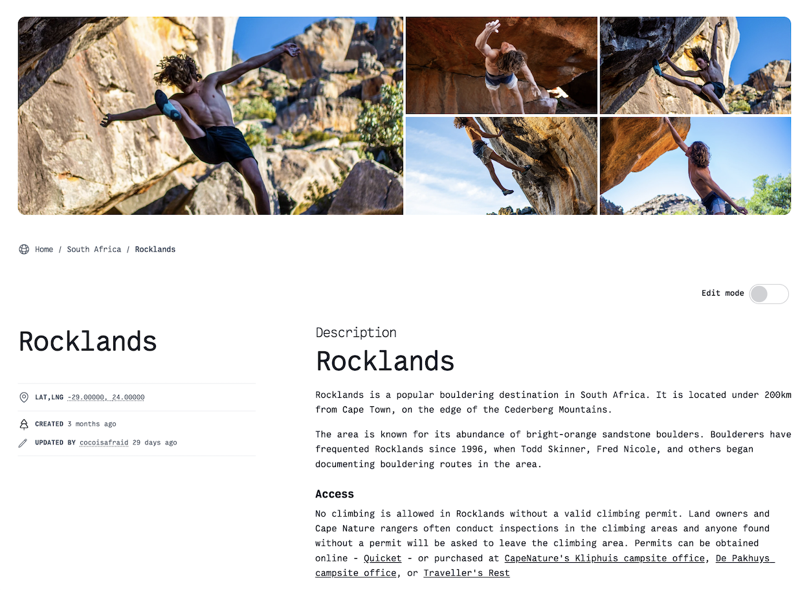
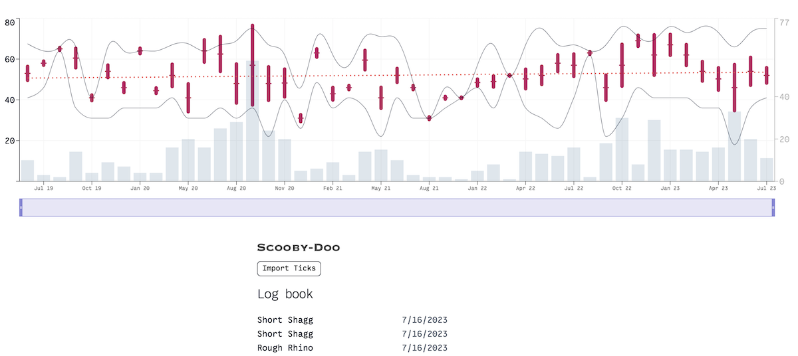
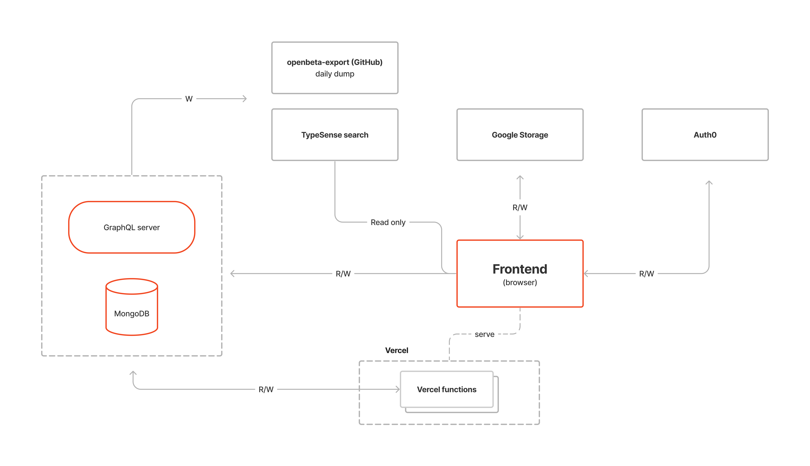

<p align="center" style="padding-top:1rem">
  <a href="https://openbeta.io">
    
  </a>
</p>
<h1 align="center">
  OpenBeta v0.9
</h1>
<p align="center">
  <strong>
    Open source. Rock climbing.  Catalog.
  </strong>
</p>

<p align="center">
  We're building a <i>free</i> and <i>open source</i> rock climbing catalog.
</p

<p align="center">
  <h2 align="center">
    <a href="https://openbeta.io">Take me to the site</a> 🚀
  </h2>
</p>

<p align="center">
The project is currently in MVP stage.<br>
<b>We'd love to hear your feedback.</b>  Chat with the dev team on <a href="https://discord.gg/ptpnWWNkJx">Discord</a>.
</p>

<p align="center">
  <a href="https://github.com/OpenBeta/open-tacos/actions/workflows/nodejs.yml?query=branch%3Adevelop">
  </a>
  &nbsp;
  <a href="./LICENSE"></a>
</p>

## Screenshot

### Climb page


### Personal performance history


## Tech stack

1. Backend GraphQL API ([openbeta-graphql](https://github.com/OpenBeta/openbeta-graphql)): Apollo GraphQL, MongoDB, Node.js.

2. Frontend (this repo): React.js, Next.js, TailwindCSS.

### High level architecture



## Live instances

| Env     | Link                          | Branch  | Content | Build                                                                                                                                                                                                                                     |
|---------|-------------------------------|---------|---------|-------------------------------------------------------------------------------------------------------------------------------------------------------------------------------------------------------------------------------------------|
| Prod    | https://openbeta.io     | develop | Complete DB    | <a href="https://github.com/OpenBeta/open-tacos/actions/workflows/nodejs.yml?query=branch%3Adevelop"> |
| Staging | https://stg.openbeta.io | develop | Partial | |

## How to build

Make sure you have the following tools installed on your computer:

- [Git](https://github.com/git-guides/install-git)
- [Node](https://nodejs.org)
- [npm](https://www.npmjs.com/get-npm)
- [yarn](https://classic.yarnpkg.com/en/docs/install)

Important: For frontend development work you **don't** need to set up the [GraphQL API server](https://github.com/OpenBeta/openbeta-graphql) server project (unless you intend to work on both).


1.  Download the repo to your local machine

```
git clone git@github.com:OpenBeta/open-tacos.git
```

2.  Build the code

```
cd open-tacos
git checkout develop
yarn install
```

4.  Run the app

```
yarn dev
```

The application is now available at http://localhost:3000


### Alternate build method using Docker

If you just want to run the app locally without installing node, npm, etc., you can do so with Docker.

**Requirements:** [Docker](https://docs.docker.com/get-docker/)

```
docker compose up
```

The application is now available at http://localhost:3000.  The project will rebuild automatically when you make changes to files in `./src` dir.
  
Note: If you install new NPM packages, you will need to rebuild the docker image with

```
docker compose up --build
```

The application is now available at `http://localhost:3000`

## Tips

### API key errors

Some parts of the code such as user profiles, page edit and photo upload require additional API keys.  Without them you'll see a bunch of errors in the log.  If you want to work on those tasks, email viet at openbeta.io for API keys.  See https://github.com/OpenBeta/open-tacos/issues/389 for more info.

### Full stack dev

By default, your local dev environment connects to our staging GraphQL API server.  To connect your environment to the Graph API server running locally:
```
yarn dev-local
```
### Typescript version warning
You might get build errors or be prompted to downgrade your version of TypeScript. This is due to the linter ```ts-standard``` using an older version of TypeScript.  You can ignore the warning message.

### Commit your work-in-progress
To commit without passing pre-build tests because you're doing a simple/unrelated change or simply wish to save your work-in-progres, run commit with the `--no-verify` flag.  Example:

```
git commit --no-verify -am "saving my work before going climbing"
```

### Linting errors
You might get linting errors when run ```yarn lint```. To fix this, if you use VS Code, please make sure you have ```StandardJS``` extension installed and enabled.

## How to contribute

See our general [How to contribute guide](https://docs.openbeta.io/how-to-contribute/overview) for more details.

## Support Us

- Give this repo a star
- Please consider [making a donation today](https://opencollective.com/openbeta) to help us pay for our infrastructure expenses ($150/month).

## Contributors

Thanks goes to these wonderful people:

<!-- ALL-CONTRIBUTORS-LIST:START - Do not remove or modify this section -->
<!-- prettier-ignore-start -->
<!-- markdownlint-disable -->
<table>
  <tbody>
    <tr>
      <td align="center" valign="top" width="14.28%"><a href="http://openbeta.io"><br /><sub><b>Viet Nguyen</b></sub></a><br /><a href="https://github.com/OpenBeta/open-tacos/commits?author=vnugent" title="Code">💻</a></td>
      <td align="center" valign="top" width="14.28%"><a href="https://github.com/catman237"><br /><sub><b>Greg Hughes</b></sub></a><br /><a href="https://github.com/OpenBeta/open-tacos/commits?author=catman237" title="Code">💻</a></td>
      <td align="center" valign="top" width="14.28%"><a href="https://github.com/on3iropolos"><br /><sub><b>on3iropolos</b></sub></a><br /><a href="#ideas-on3iropolos" title="Ideas, Planning, & Feedback">🤔</a> <a href="#financial-on3iropolos" title="Financial">💵</a></td>
      <td align="center" valign="top" width="14.28%"><a href="http://kevinnadro.com"><br /><sub><b>Kevin Nadro</b></sub></a><br /><a href="https://github.com/OpenBeta/open-tacos/commits?author=nadr0" title="Code">💻</a></td>
      <td align="center" valign="top" width="14.28%"><a href="https://github.com/rytheranderson"><br /><sub><b>rytheranderson</b></sub></a><br /><a href="https://github.com/OpenBeta/open-tacos/commits?author=rytheranderson" title="Code">💻</a> <a href="#content-rytheranderson" title="Content">🖋</a></td>
      <td align="center" valign="top" width="14.28%"><a href="http://ygingras.net"><br /><sub><b>Yannick Gingras</b></sub></a><br /><a href="#ideas-ygingras" title="Ideas, Planning, & Feedback">🤔</a> <a href="#content-ygingras" title="Content">🖋</a></td>
      <td align="center" valign="top" width="14.28%"><a href="https://github.com/gibboj"><br /><sub><b>Kendra Gibbons</b></sub></a><br /><a href="https://github.com/OpenBeta/open-tacos/commits?author=gibboj" title="Code">💻</a></td>
    </tr>
    <tr>
      <td align="center" valign="top" width="14.28%"><a href="https://github.com/galw"><br /><sub><b>Gal Weinstock</b></sub></a><br /><a href="https://github.com/OpenBeta/open-tacos/commits?author=galw" title="Code">💻</a></td>
      <td align="center" valign="top" width="14.28%"><a href="http://clintonlunn.com"><br /><sub><b>Clinton Lunn</b></sub></a><br /><a href="https://github.com/OpenBeta/open-tacos/commits?author=clintonlunn" title="Code">💻</a> <a href="#ideas-clintonlunn" title="Ideas, Planning, & Feedback">🤔</a></td>
      <td align="center" valign="top" width="14.28%"><a href="https://twitter.com/m_dimmitt"><br /><sub><b>MichaelDimmitt</b></sub></a><br /><a href="https://github.com/OpenBeta/open-tacos/commits?author=MichaelDimmitt" title="Code">💻</a> <a href="#ideas-MichaelDimmitt" title="Ideas, Planning, & Feedback">🤔</a></td>
      <td align="center" valign="top" width="14.28%"><a href="https://github.com/nthh"><br /><sub><b>Nate Hearnsberger</b></sub></a><br /><a href="https://github.com/OpenBeta/open-tacos/commits?author=nthh" title="Code">💻</a> <a href="#ideas-nthh" title="Ideas, Planning, & Feedback">🤔</a></td>
      <td align="center" valign="top" width="14.28%"><a href="https://github.com/tittaenalg"><br /><sub><b>tittaenalg</b></sub></a><br /><a href="https://github.com/OpenBeta/open-tacos/commits?author=tittaenalg" title="Code">💻</a></td>
      <td align="center" valign="top" width="14.28%"><a href="https://github.com/CocoisBuggy"><br /><sub><b>Colin Gale</b></sub></a><br /><a href="https://github.com/OpenBeta/open-tacos/commits?author=CocoisBuggy" title="Code">💻</a> <a href="#ideas-CocoisBuggy" title="Ideas, Planning, & Feedback">🤔</a></td>
      <td align="center" valign="top" width="14.28%"><a href="http://linkedin.com/in/kurk-villanueva-02779216b"><br /><sub><b>Kurk Villanueva</b></sub></a><br /><a href="https://github.com/OpenBeta/open-tacos/commits?author=bhlox" title="Code">💻</a></td>
    </tr>
    <tr>
      <td align="center" valign="top" width="14.28%"><a href="https://github.com/umaxyon"><br /><sub><b>umaxyon</b></sub></a><br /><a href="https://github.com/OpenBeta/open-tacos/commits?author=umaxyon" title="Code">💻</a></td>
      <td align="center" valign="top" width="14.28%"><a href="https://jacobstruzik.com"><br /><sub><b>Jacob Struzik</b></sub></a><br /><a href="https://github.com/OpenBeta/open-tacos/commits?author=jstruzik" title="Code">💻</a></td>
      <td align="center" valign="top" width="14.28%"><a href="https://github.com/innub"><br /><sub><b>Kevin</b></sub></a><br /><a href="https://github.com/OpenBeta/open-tacos/commits?author=innub" title="Code">💻</a></td>
      <td align="center" valign="top" width="14.28%"><a href="https://github.com/osaf96"><br /><sub><b>Osaf</b></sub></a><br /><a href="https://github.com/OpenBeta/open-tacos/commits?author=osaf96" title="Code">💻</a></td>
      <td align="center" valign="top" width="14.28%"><a href="https://github.com/xavier-kong"><br /><sub><b>xavier-kong</b></sub></a><br /><a href="https://github.com/OpenBeta/open-tacos/commits?author=xavier-kong" title="Code">💻</a></td>
      <td align="center" valign="top" width="14.28%"><a href="https://github.com/Downster"><br /><sub><b>Brendan Downing</b></sub></a><br /><a href="https://github.com/OpenBeta/open-tacos/commits?author=Downster" title="Code">💻</a></td>
      <td align="center" valign="top" width="14.28%"><a href="https://github.com/admanny"><br /><sub><b>admanny</b></sub></a><br /><a href="https://github.com/OpenBeta/open-tacos/commits?author=admanny" title="Code">💻</a></td>
    </tr>
    <tr>
      <td align="center" valign="top" width="14.28%"><a href="http://alexmandrila.com"><br /><sub><b>alex</b></sub></a><br /><a href="https://github.com/OpenBeta/open-tacos/commits?author=amandril" title="Code">💻</a> <a href="#ideas-amandril" title="Ideas, Planning, & Feedback">🤔</a></td>
      <td align="center" valign="top" width="14.28%"><a href="https://github.com/dlants"><br /><sub><b>Denis Lantsman</b></sub></a><br /><a href="https://github.com/OpenBeta/open-tacos/commits?author=dlants" title="Code">💻</a></td>
      <td align="center" valign="top" width="14.28%"><a href="https://github.com/BeaulieuC"><br /><sub><b>BeaulieuC</b></sub></a><br /><a href="#design-BeaulieuC" title="Design">🎨</a> <a href="#ideas-BeaulieuC" title="Ideas, Planning, & Feedback">🤔</a></td>
      <td align="center" valign="top" width="14.28%"><a href="https://github.com/atstp"><br /><sub><b>Daniel</b></sub></a><br /><a href="#ideas-atstp" title="Ideas, Planning, & Feedback">🤔</a></td>
      <td align="center" valign="top" width="14.28%"><a href="https://www.prajwalborkar.me/"><br /><sub><b>Prajwal</b></sub></a><br /><a href="https://github.com/OpenBeta/open-tacos/commits?author=PrajwalBorkar" title="Code">💻</a></td>
      <td align="center" valign="top" width="14.28%"><a href="https://github.com/JetseVerschuren"><br /><sub><b>Jetse Verschuren</b></sub></a><br /><a href="https://github.com/OpenBeta/open-tacos/commits?author=JetseVerschuren" title="Code">💻</a> <a href="#ideas-JetseVerschuren" title="Ideas, Planning, & Feedback">🤔</a></td>
      <td align="center" valign="top" width="14.28%"><a href="https://github.com/siman4457"><br /><sub><b>Siman Shrestha</b></sub></a><br /><a href="https://github.com/OpenBeta/open-tacos/commits?author=siman4457" title="Code">💻</a></td>
    </tr>
    <tr>
      <td align="center" valign="top" width="14.28%"><a href="https://marcosarosas.dev/"><br /><sub><b>Marcos A Rosas</b></sub></a><br /><a href="https://github.com/OpenBeta/open-tacos/commits?author=Theakayuki" title="Code">💻</a></td>
      <td align="center" valign="top" width="14.28%"><a href="https://www.kellenbusbysoftware.com"><br /><sub><b>Kellen Busby</b></sub></a><br /><a href="https://github.com/OpenBeta/open-tacos/commits?author=busbyk" title="Code">💻</a> <a href="#ideas-busbyk" title="Ideas, Planning, & Feedback">🤔</a></td>
      <td align="center" valign="top" width="14.28%"><a href="https://www.youtube.com/c/DevLeonardo"><br /><sub><b>Leonardo Montini</b></sub></a><br /><a href="https://github.com/OpenBeta/open-tacos/commits?author=Balastrong" title="Code">💻</a></td>
      <td align="center" valign="top" width="14.28%"><a href="https://github.com/matth3wdsouza"><br /><sub><b>Matthew D'Souza</b></sub></a><br /><a href="https://github.com/OpenBeta/open-tacos/commits?author=matth3wdsouza" title="Code">💻</a></td>
      <td align="center" valign="top" width="14.28%"><a href="https://github.com/Shaglock"><br /><sub><b>Ilya Shaplyko</b></sub></a><br /><a href="https://github.com/OpenBeta/open-tacos/commits?author=Shaglock" title="Code">💻</a></td>
      <td align="center" valign="top" width="14.28%"><a href="https://www.linkedin.com/in/chrisjmorin/"><br /><sub><b>Chris Morin</b></sub></a><br /><a href="https://github.com/OpenBeta/open-tacos/commits?author=christophermorin" title="Code">💻</a></td>
      <td align="center" valign="top" width="14.28%"><a href="https://github.com/poon-kittipong"><br /><sub><b>Kittipong</b></sub></a><br /><a href="https://github.com/OpenBeta/open-tacos/commits?author=poon-kittipong" title="Code">💻</a></td>
    </tr>
    <tr>
      <td align="center" valign="top" width="14.28%"><a href="https://github.com/evannoronha"><br /><sub><b>Evan Noronha</b></sub></a><br /><a href="https://github.com/OpenBeta/open-tacos/issues?q=author%3Aevannoronha" title="Bug reports">🐛</a></td>
      <td align="center" valign="top" width="14.28%"><a href="http://tedgeving.com"><br /><sub><b>ted</b></sub></a><br /><a href="https://github.com/OpenBeta/open-tacos/commits?author=tedgeving" title="Code">💻</a> <a href="#ideas-tedgeving" title="Ideas, Planning, & Feedback">🤔</a></td>
      <td align="center" valign="top" width="14.28%"><a href="https://github.com/ParthParolekar"><br /><sub><b>Parth Parolekar</b></sub></a><br /><a href="https://github.com/OpenBeta/open-tacos/commits?author=ParthParolekar" title="Code">💻</a></td>
      <td align="center" valign="top" width="14.28%"><a href="https://github.com/theonlyjunaid"><br /><sub><b>Junaid</b></sub></a><br /><a href="https://github.com/OpenBeta/open-tacos/commits?author=theonlyjunaid" title="Code">💻</a></td>
      <td align="center" valign="top" width="14.28%"><a href="https://github.com/kunal00000"><br /><sub><b>KunalVerma2468</b></sub></a><br /><a href="https://github.com/OpenBeta/open-tacos/commits?author=kunal00000" title="Code">💻</a></td>
      <td align="center" valign="top" width="14.28%"><a href="https://scotthoecker.com"><br /><sub><b>Scott Hoecker</b></sub></a><br /><a href="https://github.com/OpenBeta/open-tacos/commits?author=Scott2bReal" title="Code">💻</a></td>
      <td align="center" valign="top" width="14.28%"><a href="https://github.com/vcbenj"><br /><sub><b>vcbenj</b></sub></a><br /><a href="https://github.com/OpenBeta/open-tacos/commits?author=vcbenj" title="Code">💻</a></td>
    </tr>
    <tr>
      <td align="center" valign="top" width="14.28%"><a href="https://github.com/ramzyraz"><br /><sub><b>Ramez Salman</b></sub></a><br /><a href="https://github.com/OpenBeta/open-tacos/commits?author=ramzyraz" title="Code">💻</a></td>
      <td align="center" valign="top" width="14.28%"><a href="https://github.com/diericx"><br /><sub><b>Zac Holland</b></sub></a><br /><a href="#ideas-diericx" title="Ideas, Planning, & Feedback">🤔</a> <a href="https://github.com/OpenBeta/open-tacos/commits?author=diericx" title="Code">💻</a></td>
      <td align="center" valign="top" width="14.28%"><a href="https://github.com/daniel-n-kaye"><br /><sub><b>daniel-n-kaye</b></sub></a><br /><a href="#ideas-daniel-n-kaye" title="Ideas, Planning, & Feedback">🤔</a></td>
      <td align="center" valign="top" width="14.28%"><a href="http://kaomorphism.com"><br /><sub><b>zkao</b></sub></a><br /><a href="https://github.com/OpenBeta/open-tacos/commits?author=zichongkao" title="Code">💻</a> <a href="#ideas-zichongkao" title="Ideas, Planning, & Feedback">🤔</a></td>
      <td align="center" valign="top" width="14.28%"><a href="http://nathan.musoke.ca"><br /><sub><b>Nathan Musoke</b></sub></a><br /><a href="#ideas-musoke" title="Ideas, Planning, & Feedback">🤔</a> <a href="https://github.com/OpenBeta/open-tacos/commits?author=musoke" title="Code">💻</a></td>
      <td align="center" valign="top" width="14.28%"><a href="https://www.linkedin.com/in/bermanuri/"><br /><sub><b>Uri Berman</b></sub></a><br /><a href="https://github.com/OpenBeta/open-tacos/commits?author=Urik" title="Code">💻</a></td>
      <td align="center" valign="top" width="14.28%"><a href="https://github.com/actuallyyun"><br /><sub><b>Yun Ji</b></sub></a><br /><a href="#ideas-actuallyyun" title="Ideas, Planning, & Feedback">🤔</a></td>
    </tr>
    <tr>
      <td align="center" valign="top" width="14.28%"><a href="https://github.com/danekshea"><br /><sub><b>Dane Shea</b></sub></a><br /><a href="https://github.com/OpenBeta/open-tacos/commits?author=danekshea" title="Code">💻</a> <a href="#ideas-danekshea" title="Ideas, Planning, & Feedback">🤔</a> <a href="#financial-danekshea" title="Financial">💵</a></td>
      <td align="center" valign="top" width="14.28%"><a href="https://github.com/Colb131"><br /><sub><b>Colb131</b></sub></a><br /><a href="https://github.com/OpenBeta/open-tacos/issues?q=author%3AColb131" title="Bug reports">🐛</a></td>
      <td align="center" valign="top" width="14.28%"><a href="https://github.com/sjdex"><br /><sub><b>Shubham Jadhav</b></sub></a><br /><a href="https://github.com/OpenBeta/open-tacos/commits?author=sjdex" title="Code">💻</a></td>
      <td align="center" valign="top" width="14.28%"><a href="http://ohitsjoe.co"><br /><sub><b>Joe Oliver</b></sub></a><br /><a href="https://github.com/OpenBeta/open-tacos/commits?author=saferthanhouses" title="Code">💻</a> <a href="#ideas-saferthanhouses" title="Ideas, Planning, & Feedback">🤔</a></td>
      <td align="center" valign="top" width="14.28%"><a href="https://github.com/hawkishpolicy"><br /><sub><b>Thomas Johnson</b></sub></a><br /><a href="https://github.com/OpenBeta/open-tacos/commits?author=hawkishpolicy" title="Code">💻</a></td>
      <td align="center" valign="top" width="14.28%"><a href="https://github.com/giri-madhan"><br /><sub><b>Giri Madhan</b></sub></a><br /><a href="https://github.com/OpenBeta/open-tacos/commits?author=giri-madhan" title="Code">💻</a></td>
      <td align="center" valign="top" width="14.28%"><a href="https://github.com/josh610"><br /><sub><b>Josh Zimmerman</b></sub></a><br /><a href="https://github.com/OpenBeta/open-tacos/commits?author=josh610" title="Code">💻</a></td>
    </tr>
    <tr>
      <td align="center" valign="top" width="14.28%"><a href="https://github.com/dww3000"><br /><sub><b>DavidW</b></sub></a><br /><a href="#projectManagement-dww3000" title="Project Management">📆</a> <a href="#ideas-dww3000" title="Ideas, Planning, & Feedback">🤔</a></td>
      <td align="center" valign="top" width="14.28%"><a href="https://github.com/Ali7040"><br /><sub><b>Ali Haider</b></sub></a><br /><a href="https://github.com/OpenBeta/open-tacos/commits?author=Ali7040" title="Code">💻</a></td>
      <td align="center" valign="top" width="14.28%"><a href="https://github.com/shyamtawli"><br /><sub><b>Shyam Tawli</b></sub></a><br /><a href="https://github.com/OpenBeta/open-tacos/commits?author=shyamtawli" title="Code">💻</a></td>
      <td align="center" valign="top" width="14.28%"><a href="https://github.com/SidV2"><br /><sub><b>SidV2</b></sub></a><br /><a href="https://github.com/OpenBeta/open-tacos/commits?author=SidV2" title="Code">💻</a></td>
      <td align="center" valign="top" width="14.28%"><a href="http://www.bkanawati.com"><br /><sub><b>Bader Kanawati</b></sub></a><br /><a href="https://github.com/OpenBeta/open-tacos/commits?author=baderk" title="Code">💻</a></td>
      <td align="center" valign="top" width="14.28%"><a href="https://github.com/draykhlin"><br /><sub><b>draykhlin</b></sub></a><br /><a href="https://github.com/OpenBeta/open-tacos/commits?author=draykhlin" title="Documentation">📖</a></td>
      <td align="center" valign="top" width="14.28%"><a href="https://github.com/sjsikora"><br /><sub><b>Sam Sikora</b></sub></a><br /><a href="https://github.com/OpenBeta/open-tacos/commits?author=sjsikora" title="Code">💻</a></td>
    </tr>
    <tr>
      <td align="center" valign="top" width="14.28%"><a href="https://github.com/andrew-jp"><br /><sub><b>Andrew Pritchett</b></sub></a><br /><a href="https://github.com/OpenBeta/open-tacos/commits?author=andrew-jp" title="Code">💻</a> <a href="#ideas-andrew-jp" title="Ideas, Planning, & Feedback">🤔</a></td>
      <td align="center" valign="top" width="14.28%"><a href="https://github.com/milbmr"><br /><sub><b>MiloudB</b></sub></a><br /><a href="https://github.com/OpenBeta/open-tacos/commits?author=milbmr" title="Code">💻</a></td>
      <td align="center" valign="top" width="14.28%"><a href="https://sarthak-kumar-shailendra.github.io/portfolio"><br /><sub><b>Sarthak Kumar Shailendra</b></sub></a><br /><a href="https://github.com/OpenBeta/open-tacos/commits?author=sarthak-kumar-shailendra" title="Code">💻</a></td>
      <td align="center" valign="top" width="14.28%"><a href="https://irfanfaraz-portfolio.vercel.app/"><br /><sub><b>Syed Irfan Faraz</b></sub></a><br /><a href="https://github.com/OpenBeta/open-tacos/commits?author=irfanfaraaz" title="Code">💻</a></td>
      <td align="center" valign="top" width="14.28%"><a href="https://github.com/enapupe"><br /><sub><b>Iacami Gevaerd</b></sub></a><br /><a href="https://github.com/OpenBeta/open-tacos/issues?q=author%3Aenapupe" title="Bug reports">🐛</a></td>
      <td align="center" valign="top" width="14.28%"><a href="https://github.com/calvincheng919"><br /><sub><b>Calvin Cheng</b></sub></a><br /><a href="https://github.com/OpenBeta/open-tacos/issues?q=author%3Acalvincheng919" title="Bug reports">🐛</a></td>
      <td align="center" valign="top" width="14.28%"><a href="https://snarfme.com"><br /><sub><b>robbyriley15</b></sub></a><br /><a href="https://github.com/OpenBeta/open-tacos/commits?author=robbyriley15" title="Code">💻</a> <a href="https://github.com/OpenBeta/open-tacos/commits?author=robbyriley15" title="Documentation">📖</a></td>
    </tr>
    <tr>
      <td align="center" valign="top" width="14.28%"><a href="https://github.com/Ali-muhammed7040"><br /><sub><b>Ali Muhammad</b></sub></a><br /><a href="https://github.com/OpenBeta/open-tacos/commits?author=Ali-muhammed7040" title="Code">💻</a></td>
      <td align="center" valign="top" width="14.28%"><a href="http://henryaviles.vercel.app"><br /><sub><b>Henry Aviles</b></sub></a><br /><a href="https://github.com/OpenBeta/open-tacos/commits?author=Haviles04" title="Code">💻</a></td>
      <td align="center" valign="top" width="14.28%"><a href="https://shravaniroy.netlify.app/"><br /><sub><b>ShravaniRoy</b></sub></a><br /><a href="https://github.com/OpenBeta/open-tacos/commits?author=ShravaniRoy" title="Code">💻</a></td>
      <td align="center" valign="top" width="14.28%"><a href="https://github.com/isaac-aa"><br /><sub><b>Isaac Alonso</b></sub></a><br /><a href="https://github.com/OpenBeta/open-tacos/commits?author=isaac-aa" title="Code">💻</a> <a href="#ideas-isaac-aa" title="Ideas, Planning, & Feedback">🤔</a></td>
      <td align="center" valign="top" width="14.28%"><a href="https://github.com/btmccord"><br /><sub><b>Blake McCord</b></sub></a><br /><a href="https://github.com/OpenBeta/open-tacos/commits?author=btmccord" title="Code">💻</a> <a href="#ideas-btmccord" title="Ideas, Planning, & Feedback">🤔</a></td>
      <td align="center" valign="top" width="14.28%"><a href="https://github.com/heliodor"><br /><sub><b>Heliodor Jalba</b></sub></a><br /><a href="#ideas-heliodor" title="Ideas, Planning, & Feedback">🤔</a> <a href="https://github.com/OpenBeta/open-tacos/issues?q=author%3Aheliodor" title="Bug reports">🐛</a></td>
      <td align="center" valign="top" width="14.28%"><a href="https://github.com/athuv"><br /><sub><b>Ahamed Athhar</b></sub></a><br /><a href="https://github.com/OpenBeta/open-tacos/commits?author=athuv" title="Code">💻</a> <a href="#ideas-athuv" title="Ideas, Planning, & Feedback">🤔</a></td>
    </tr>
    <tr>
      <td align="center" valign="top" width="14.28%"><a href="https://github.com/melissapthai"><br /><sub><b>Melissa Thai</b></sub></a><br /><a href="https://github.com/OpenBeta/open-tacos/commits?author=melissapthai" title="Code">💻</a></td>
      <td align="center" valign="top" width="14.28%"><a href="https://github.com/d-k-lippert"><br /><sub><b>Dom Klip</b></sub></a><br /><a href="https://github.com/OpenBeta/open-tacos/commits?author=d-k-lippert" title="Code">💻</a> <a href="#ideas-d-k-lippert" title="Ideas, Planning, & Feedback">🤔</a></td>
      <td align="center" valign="top" width="14.28%"><a href="https://github.com/salgadopietrini"><br /><sub><b>Manuel Salgado</b></sub></a><br /><a href="https://github.com/OpenBeta/open-tacos/commits?author=salgadopietrini" title="Code">💻</a></td>
      <td align="center" valign="top" width="14.28%"><a href="https://github.com/svkorepanov"><br /><sub><b>Sergey Korepanov</b></sub></a><br /><a href="https://github.com/OpenBeta/open-tacos/commits?author=svkorepanov" title="Code">💻</a></td>
      <td align="center" valign="top" width="14.28%"><a href="http://aimeekang.dev"><br /><sub><b>Aimee Kang</b></sub></a><br /><a href="https://github.com/OpenBeta/open-tacos/commits?author=aimeekang" title="Code">💻</a></td>
    </tr>
  </tbody>
</table>

<!-- markdownlint-restore -->
<!-- prettier-ignore-end -->

<!-- ALL-CONTRIBUTORS-LIST:END -->

This project follows the [all-contributors](https://github.com/all-contributors/all-contributors) specification. Contributions of any kind welcome.

## License

AGPL
